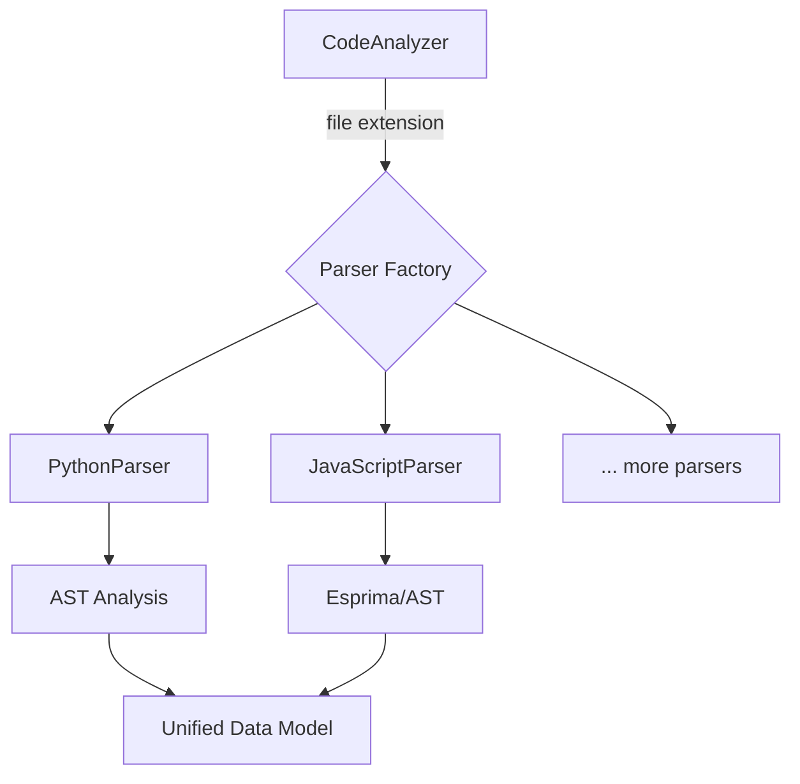

# Unified Parser Design Document

## 1. Introduction

The goal of this document is to design a new, unified code analysis component that merges the strengths of the existing `worker/parser.py` and the proposed `code_analyzer` from `WORKERLOGIC.MD`. This new component will provide a modular, extensible, and efficient architecture for parsing multiple programming languages, starting with Python and JavaScript/TypeScript.

## 2. High-Level Architecture

The proposed architecture is based on a central `CodeAnalyzer` class that delegates parsing to language-specific parser classes. This design allows for easy extension to support new languages and keeps the core logic clean and maintainable.



The `CodeAnalyzer` will be responsible for:
- Receiving a file path.
- Identifying the language based on the file extension.
- Instantiating the appropriate language-specific parser.
- Returning the parsed data in a common format.

## 3. Class Structure

### `CodeAnalyzer`

The main entry point for code analysis.

```python
class CodeAnalyzer:
    def __init__(self):
        self.parsers = {
            '.py': PythonParser(),
            '.js': JavaScriptParser(),
            '.ts': JavaScriptParser(),
            # ... other languages
        }

    def analyze_file(self, file_path: str) -> dict:
        """
        Analyzes a single file and returns structured data.
        """
        extension = os.path.splitext(file_path)[1]
        parser = self.parsers.get(extension)
        if parser:
            return parser.parse(file_path)
        return None
```

### `BaseParser` (Abstract Class)

An abstract base class that defines the interface for all language-specific parsers.

```python
from abc import ABC, abstractmethod

class BaseParser(ABC):
    @abstractmethod
    def parse(self, file_path: str) -> dict:
        """
        Parses a file and returns data in the unified data model.
        """
        pass
```

### `PythonParser`

A parser for Python files that uses the built-in `ast` module.

```python
class PythonParser(BaseParser):
    def parse(self, file_path: str) -> dict:
        # Implementation using ast module
        # ...
        return {
            "functions": [],
            "classes": [],
            "imports": [],
        }
```

### `JavaScriptParser`

A parser for JavaScript and TypeScript files that uses an external library like `esprima`.

```python
class JavaScriptParser(BaseParser):
    def parse(self, file_path: str) -> dict:
        # Implementation using esprima or similar
        # ...
        return {
            "functions": [],
            "classes": [],
            "imports": [],
        }
```

## 4. Data Model

A unified data model will be used to represent the parsed information consistently across all languages. This ensures that downstream tools can process the data without needing to know the source language.

```json
{
  "file_path": "path/to/file.py",
  "language": "python",
  "size": 1024,
  "lines": 120,
  "functions": [
    {
      "name": "my_function",
      "args": [
        {"name": "arg1", "type": "str"},
        {"name": "arg2", "type": "int"}
      ],
      "return_type": "bool",
      "start_line": 10,
      "end_line": 25,
      "docstring": "This is a docstring.",
      "is_async": false
    }
  ],
  "classes": [
    {
      "name": "MyClass",
      "methods": [
        {
          "name": "my_method",
          "args": [{"name": "self"}],
          "start_line": 30,
          "end_line": 40
        }
      ],
      "attributes": [
        {"name": "my_attribute", "type": "str"}
      ],
      "parent_classes": ["BaseClass"],
      "start_line": 28,
      "end_line": 45
    }
  ],
  "imports": [
    {"module": "os", "alias": null},
    {"module": "sys", "alias": "system"}
  ]
}
```

## 5. Language Support Strategy

Adding support for a new language will involve the following steps:

1.  **Create a new parser class:** Create a new class that inherits from `BaseParser` (e.g., `JavaParser`).
2.  **Implement the `parse` method:** Implement the `parse` method to handle the specific language. This may involve using a third-party library for AST parsing (e.g., `javalang` for Java).
3.  **Register the parser:** Add the new parser to the `parsers` dictionary in the `CodeAnalyzer` class, mapping the file extension to the new parser instance.

This modular approach makes it straightforward to extend the system's capabilities without modifying the core logic.